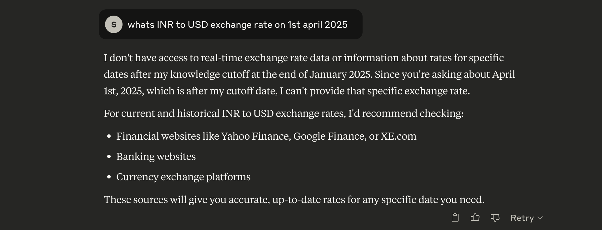
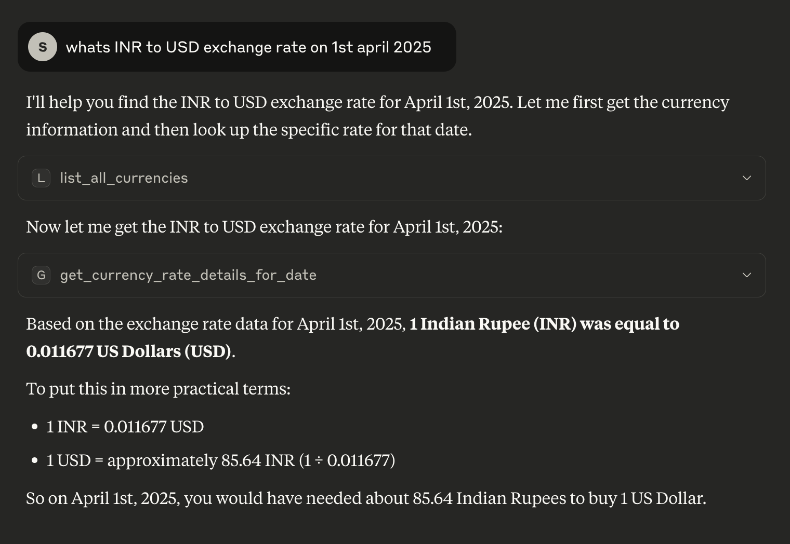
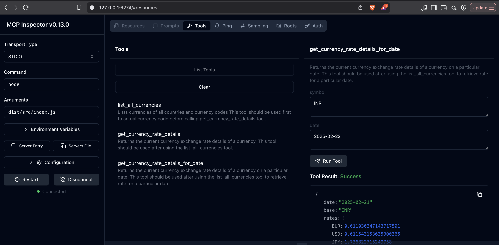

### Introduction
 - This repo contains code for a simple [MCP server](https://modelcontextprotocol.io/introduction) which contains tools for fetching exchange rates between currencies.
 - This MCP Server relies on [ExchangeRate APIs](https://api.vatcomply.com/rates?base=USD) provided by [VATComply](https://www.vatcomply.com/documentation#currencies) website.
 - Sample screenshots of response of Claude 4 Sonnet:-
   - Without MCP Server:-
    
   - With MCP Server enabled:-
    


### Steps to use and Tech Stack:-
- This project is simple TS-MCP server which uses [pnpm](https://pnpm.io/) for dependency management.
- Steps to use this server:-
  - Clone the repo to your local machine.
  - Run `pnpm install` command.
  - Run `pnpm build` command. This creates dist/src/index.js file which will be used as MCPServer.
  - Add below config to `claude_desktop_config.json` file:-
  ```
      "currencyrate": {
      "command": "node",
      "args": [
        "/Users/sripadt/Projects/CurrencyRate-MCP/dist/src/index.js"
      ]
    }
  ```
  - With this step, MCPServer is available for usage with Claude desktop.
  #### Steps to run MCP server manually:-
  - If you wish to debug this using [MCPInspector](https://modelcontextprotocol.io/docs/tools/inspector), you can run the command `pnpm dlx  @modelcontextprotocol/inspector`
	  - This opens up MCPInspector UI on http://127.0.0.1:6274/ where you need to specify `node` as command to run with `dist/src/index.js` as argument. This gives us UI to connect with out mcp server for debugging.
    - Screenshot - 
    